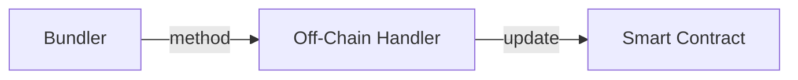

# Introduction

Welcome to the developer documentation for implementing a basic example with our system and API. This guide will walk you through the necessary steps to get started and provide you with the information you need to successfully integrate our system into your project. Additionally, you can view a [full example](https://github.com/bobanetwork/aa-hc-example) on our Github.

## About Hybrid Compute

Hybrid Compute in the Boba Network allows smart contracts to interact with external data and services. Typically, smart contracts on blockchains like Ethereum are limited to the data available on the blockchain, unable to access outside information directly. Hybrid Compute changes this by enabling smart contracts to make API calls to external services. This interaction allows smart contracts to both access data and perform complex computations off-chain. 

The results of these computations can then be used on-chain, enhancing the functionality and efficiency of smart contracts. By doing so, Hybrid Compute reduces gas costs associated with complex computations and broadens the scope of what decentralized applications (dApps) can achieve. In essence, it bridges the gap between the blockchain and the real world, allowing for more sophisticated and dynamic applications.

Hybrid Compute is built on top of [Account Abstraction](../account-abstraction/index).

## Prerequisites

Before you begin, make sure you have the following prerequisites in place:

- Python
- Docker

Once your environment is ready, proceed through the following steps to implement your Hybrid Compute examples.
